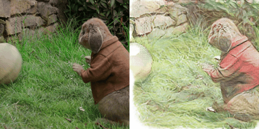
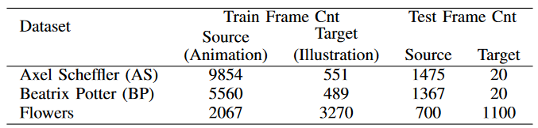
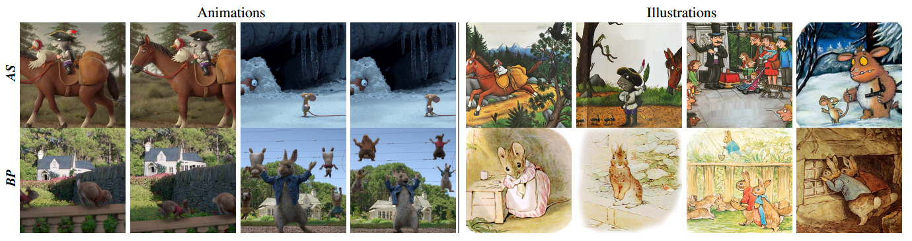
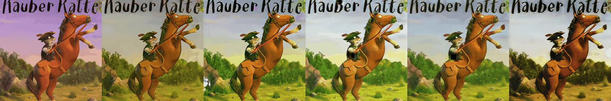
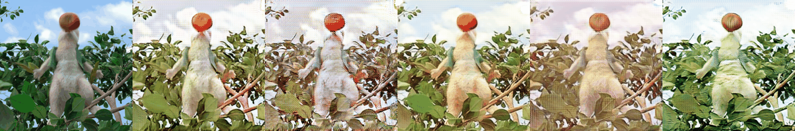

# WAIT

We provide official PyTorch implementation for: 

WAIT: Feature Warping for Animation to Illustration video Translation using GANs

[Arxiv](https://arxiv.org/abs/2310.04901)




**Dataset Stats:**



**Sample Images:**




**WAIT**:

Here we compare the WAIT results with baseline methods.
From left the right; 

**Input, CycleGAN, OpticalFlowWarping, ReCycleGAN, ReCycleGANv2, WAIT** 

**WAIT results on AS Style:**




**WAIT results on BP Style:**




## Prerequisites
- Linux, macOS or Windows
- Python 3.6+
- NVIDIA GPU
- CUDA 11.1
- CuDNN 8.0.5

## Getting Started

### Downloading Datasets
Please refer to [datasets.md](docs/datasets.md) for details.

### Installation

- Clone this repo:
```bash
git clone https://github.com/giddyyupp/wait.git
cd wait
```

- Install PyTorch 1.5+ and torchvision from http://pytorch.org and other dependencies (e.g., [visdom](https://github.com/facebookresearch/visdom) and [dominate](https://github.com/Knio/dominate)). You can install all the dependencies by
```bash
pip install -r requirements.txt
```

- Build Deformable Conv layers:
```
cd models/deform_conv
python setup.py install develop
```
### WAIT Train & Test

- Download a GANILLA illustrator dataset and corresponding animation movies (e.g. BP). For illustration dataset please follow the steps explained in [Ganilla](https://github.com/giddyyupp/ganilla) repository. For animations, we use Peter Rabbit movie to curate BP dataset, and videos from [ZOG](https://www.youtube.com/@ZogOfficial) Youtube channel for AS dataset.  


- Train a model:
```
python train.py --dataroot ./datasets/bp_dataset --name bp_wait --model cycle_gan_warp --netG resnet_9blocks \ 
--centerCropSize 256 --resize_or_crop resize_and_centercrop --batch_size 8 --lr 0.0008 --niter_decay 200 --verbose \ 
--norm_warp "batch" --use_warp_speed_ups --rec_bug_fix --final_conv --merge_method "concat" --time_gap 2 \ 
--offset_network_block_cnt 8 --warp_layer_cnt 5
```
- To view training results and loss plots, run `python -m visdom.server` and click the URL http://localhost:8097. 
To see more intermediate results, check out `./checkpoints/bp_wait/web/index.html`

- Test the model:
With assigning correct variables to dataset, EXP_ID, and backbone;
```bash
#!./scripts/test_warp_models.sh ./datasets/"$dataset" $EXP_ID $backbone $dataset --norm_warp "batch" --rec_bug_fix --use_warp_speed_ups --final_conv --merge_method "concat"
```
or 
```
python test.py --dataroot ./datasets/bp_dataset --name bp_wait --model cycle_gan_warp --netG resnet_9blocks \ 
--centerCropSize 256 --resize_or_crop center_crop --no_flip --phase test --epoch 200 --time_gap 0 --norm_warp "batch" \
--rec_bug_fix --final_conv --merge_method "concat" --offset_network_block_cnt 8 --warp_layer_cnt 5
```

The test results will be saved to a html file here: `./results/bp_wait/latest_test/index.html`.


### Calculate Metrics

- To calculate FID & MSE you can directly use our scripts in `scripts/metrics` directory.
```
cd scripts/metrics
./calculate_FID_batch.sh path_to_source path_to_result
```

- To calculate FWE you need to install [this repo](https://github.com/phoenix104104/fast_blind_video_consistency) and 
preprocess the dataset described as [here](https://github.com/phoenix104104/fast_blind_video_consistency#evaluation).

We put 2 helper scripts in the `metrics/FWE` folder, just copy paste them to the main directory of the above repo.

More specifically, lets assume you would like to calculate a model trained on `AS` dataset, and you run the inference and want to calculate the FWE. 
First, rename your generated images so that they start from 000000.png and end at 001234.png using:
```
python rename_video_frames.py
```
here you need to fix `data_dir` and `target_dir` parameters based on your needs. 
Second, if your `testA` images are not in the same order as mentioned above, again fix the input parameters and run `python rename_video_frames.py` again on the test images.

Now we should put the real and generated images to correct folders to proceed with flow occlusion and FWE calculations.
For generated images, create a folder in the path `./data/test/wait/fwe/AS/testA` and put all the renamed generated images there.
For real images, create a folder in the path `./data/test/input/AS/testA` and put all the renamed real images there.

Now you have real and generated images at the same order and renamed properly and put in the correct folders. Lets calculate flow occlusions. The script to use is `compute_flow_occlusion.py`.
If you inspect it, there is one required parameter which is `-dataset`. For our case it is `AS`. Create a .txt file in the path `./lists/AS_test.txt` and just put testA in the first line and save. Run below to generate flow occlusions.
```
python compute_flow_occlusion.py -dataset "AS" 
```

Finally, run below command to compute the FWE score.

```
python evaluate_WarpError.py -method "wait" -task fwe -dataset AS
```

- We also provide a single script to calculate all metrics in single run.

```
cd scripts/
./calculate_metrics_all.sh path_to_wait_repo exp_name dataset_name path_to_fwe_repo
```

You can find more scripts at `scripts` directory.

### Apply a pre-trained model (WAIT)
- You can download our pretrained models (AS, BP in the paper, and IRVI traffic from [https://github.com/BIT-DA/I2V-GAN](I2V-GAN)) using following [https://drive.google.com/drive/folders/1-SxVeN_MUUeRy6M6cg1XcMOoJGkGujls?usp=sharing](GDrive).

Put the pretrained models under `./checkpoints/`.

- Then generate the results for BP dataset using:

```bash
python test.py --dataroot ./datasets/bp_dataset --name bp_wait --model cycle_gan_warp --netG resnet_9blocks \ 
--centerCropSize 256 --resize_or_crop center_crop --no_flip --phase test --epoch 200 --time_gap 0 --norm_warp "batch" \
--rec_bug_fix --final_conv --merge_method "concat" --offset_network_block_cnt 8 --warp_layer_cnt 5
```

The results will be saved at `./results/`. Use `--results_dir {directory_path_to_save_result}` to specify the results directory.

## Citation
If you use this code for your research, please cite our papers.
```
@misc{hicsonmez2023wait,
      title={WAIT: Feature Warping for Animation to Illustration video Translation using GANs}, 
      author={Samet Hicsonmez and Nermin Samet and Fidan Samet and Oguz Bakir and Emre Akbas and Pinar Duygulu},
      year={2023},
      eprint={2310.04901},
      archivePrefix={arXiv},
      primaryClass={cs.CV}
}

```
## Acknowledgments
Our code is heavily inspired by [GANILLA](https://github.com/giddyyupp/ganilla).

The numerical calculations reported in this work were fully performed at TUBITAK ULAKBIM, High Performance and Grid Computing Center (TRUBA resources).
